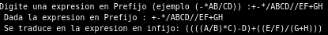
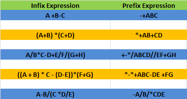
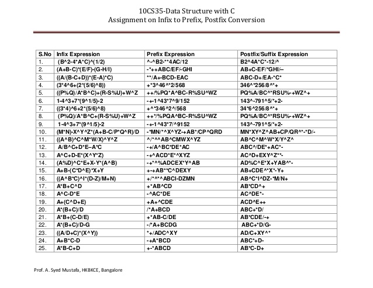

# Prefix to Infix. Taller2 estructuras.

C program to convert from prefix to infix.

## Installation

gcc prefix2infix.cpp

## Usage
Implementar un programa en C++ que permita leer una expresión en notación Prefijo y la traduzca a notación Infijo.

### Tested strings:

Prefix | Infix
------------ | -------------
++A*BCD | A+B*C+D |ABC*+D+
*+AB+CD | (A+B)*(C+D) |AB+CD+*
+*AB*CD | A*B+C*D |AB*CD*+
+++ABCD | A+B+C+D |AB+C+D+
-+*AB*CDE |A*B+C*D-E
-+*12*345 |
+-*/ABCD//EF+GH |A/B*C-D+E/F/(G+H)
*-*+ABC-DE+FG   |((A+B)*C-(D-E))*(F+G)

## Contributing

1. Fork it!
2. Create your feature branch: `git checkout -b my-new-feature`
3. Commit your changes: `git commit -am 'Add some feature'`
4. Push to the branch: `git push origin my-new-feature`
5. Submit a pull request :D

## History

Some fixes, tactica de señuelo en el correo, waiting for the OBSERVATIONS of "profesional ingenier".

## Credits

http://scanftree.com/Data_Structure/prefix-to-infix
This is a good implementation of the program, in fact, my own code is based on this example. Nevertheless this original code have some restricttions, and are "fixed" on this implementation.

Test examples:
https://yoursandmyideas.wordpress.com/2012/04/07/infixtoprefix/
http://www.slideshare.net/syedmustafablr/infix-prefix-postfix-expression-conversion

## License

The source is under terms of the MIT license.
